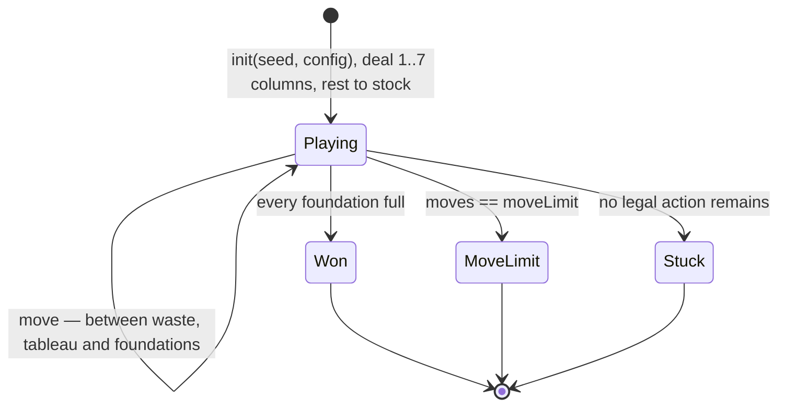

# 01-cozy-solitaire — design

Written from the code: `src/sim.ts`, `src/invariants.ts`, `config/*.json`.
The code wins every disagreement.

## Core loop

Klondike, one player. A shuffled deck is dealt into seven columns of
1..7 cards, the last of each face up; the rest becomes the stock. You
move cards between the columns to uncover what is buried, and send them
to four foundation piles, one per suit, ace upward. The deal is won when
all 52 cards are home.

- **Win:** every foundation is full.
- **Lose:** no legal move remains (`stuck`), or the move limit is
  reached (`move-limit`). With unlimited passes, `stuck` is rare —
  turning the stock is nearly always legal — so a dead deal usually ends
  at the move limit instead.

There is no score, no timer and no penalty for undoing.

## Entities

| Entity | State |
|---|---|
| Card | One integer. `suit = card / ranks`, `rank = card % ranks`, rank 0 is the ace. Colour is `suit % 2`, so suits 0 and 2 share a colour and 1 and 3 share the other. |
| Stock | `number[]`, face down. The last entry is the top. |
| Waste | `number[]`, face up. Only the last entry is in play. |
| Foundation | One array per suit. `foundations[s][r]` is always the card of suit `s`, rank `r`. |
| Tableau pile | `{ down, up }`. `down` is face down; `up` is a descending, alternating-colour run. |
| Deal | `moves`, `passes`, `result`, plus the seed and RNG state. |

## Actions

| Action | Legal when | Changes |
|---|---|---|
| `{ type: "draw" }` | The stock has cards, **or** the waste does and passes are left | Turns `drawCount` cards to the waste. With the stock empty, turns the waste back over instead and spends a pass |
| `{ type: "move", from, to, count }` | The source can give `count` cards and the destination takes them | Moves the run; uncovers the source's next face-down card if that empties it |

`from` and `to` are `{ kind, index }` with kind `waste`, `foundation` or
`tableau` (`stock` may only be drawn from, never moved out of by hand).

Destination rules:
- **Foundation** — `count` must be 1, the card's suit must match the
  foundation's index, and its rank must be exactly the pile's height, so
  the ace goes first and the rest follow in order.
- **Tableau** — one rank below the top card and the opposite colour. An
  empty column takes only a king when `emptyTableauNeedsKing` is set,
  otherwise anything.

Moving cards back off a foundation is legal; solitaire allows it, and it
is occasionally the only way through.

`applyAction` throws rather than ignoring: an unknown player, an action
after the deal has ended, a source that cannot give the cards, or a
destination that will not take them. Illegal input is a bug, not a no-op.

Turning over a face-down card is not an action. It happens by itself
whenever a move empties a column's face-up run, so it can never be
forgotten or done twice.

## State machine

Turns are discrete; there is no timestep. Every action is checked for an
ending immediately after it applies.

## Hidden information

`viewFor(state, viewer)` is the only way the renderer sees the deal.

| Field | Shown | Hidden |
|---|---|---|
| Stock | `stockCount` | Every card and its order |
| Tableau `down` | `downCount` per column | Every card |
| Tableau `up` | The cards | — |
| Waste | The top card, and `wasteCount` | The cards under the top |
| Foundations | The cards | — |
| RNG, seed | — | Both. The RNG would give away every future draw |

Single player, but the redaction still matters: the renderer cannot
accidentally draw a face-down card, and the `no-peeking` invariant checks
that after every action.

## Tuning

`config/sim.json` — changing any of these changes replay hashes.

| Value | Now | Controls |
|---|---|---|
| `version` | 1 | Config version, stamped into every replay and session log |
| `suits` | 4 | Suits in the deck, and therefore foundations. Must be even |
| `ranks` | 13 | Ranks per suit. Fewer makes a much shorter deal |
| `tableauPiles` | 7 | Columns dealt |
| `drawCount` | 1 | Cards turned per draw. 3 is the harder classic |
| `maxPasses` | 0 | Times the waste may be turned back over. 0 is unlimited |
| `emptyTableauNeedsKing` | true | Whether an empty column takes only a king |
| `moveLimit` | 500 | Safety net so every automated deal terminates |

`config/replay.json` — `checkpointEvery: 50`. `config/verify.json` —
`seedCount: 20`, `maxActions: 1000`, `smokeSeed: 1`. `config/ui.json`
and `config/theme.json` do not affect the sim.

## Measured

`pnpm sim 01-cozy-solitaire --seeds 200`, greedy bot, `sim@1`:

| | |
|---|---|
| Won | 43.0% (86/200) |
| Ran out of moves | 57.0% |
| Moves per deal | 339 mean, 99 min, 500 max |
| Cards home | 28.0 mean, 0 min, 52 max |

Read the win rate as a **floor**. The bot in `src/bot.ts` sends every
card home as soon as it can and never plans, so a deal it wins is
certainly winnable and a deal it loses may still be. Raising `moveLimit`
from 500 to 1500 changed no outcome — the extra moves went into cycling
the stock — so the limit is not hiding winnable deals.

## Invariants

Checked after every action, in the seed sweep and in the browser
playtest (`src/invariants.ts`):

- **deck-conserved** — every card exists exactly once across stock,
  waste, foundations and tableau. The one that catches miscounted splices.
- **foundation-order** — each foundation holds its own suit, ace upward,
  with no gaps.
- **tableau-run** — every face-up run descends by one rank and alternates
  colour.
- **tableau-flipped** — no column has face-down cards under nothing.
- **move-budget** — `moves` and `passes` stay within their limits.
- **result-consistent** — `won` is set exactly when every card is home.
- **no-peeking** — nothing `viewFor` returns is a card that is face down.

## Known gaps

- No animation, sound, scoring or timer. See the README.
- Session logs are printed to the console, not written to `sessions/`.
- The bot does not plan, so `pnpm sim` cannot yet answer "is this deal
  winnable at all" — only "did a greedy player win it".
