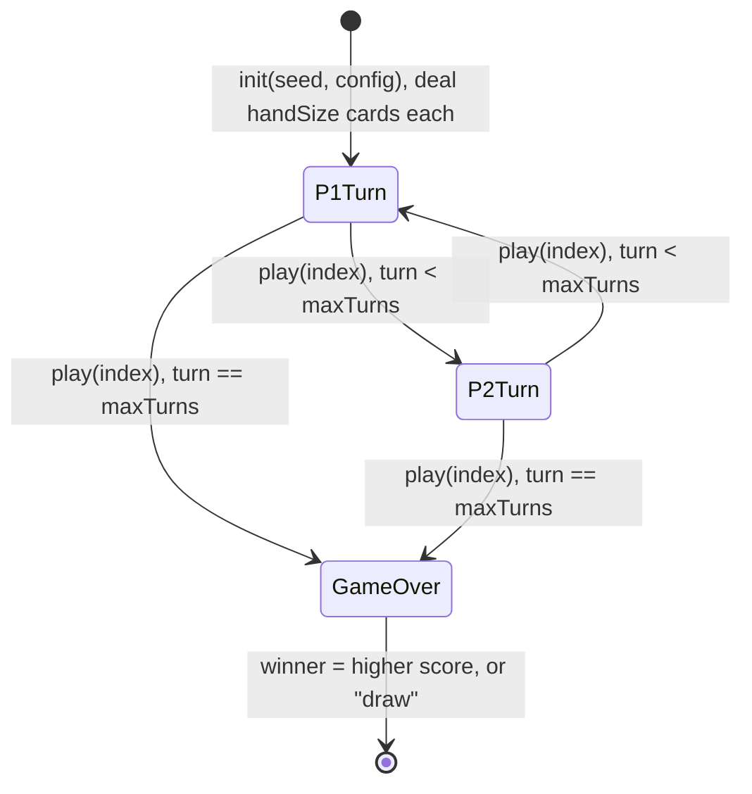

# _template — design

Generated from the code by the `extract-design-doc` skill. The code wins
every disagreement: `src/sim.ts`, `src/invariants.ts`, `config/*.json`.

This is the template's placeholder game. It exists to exercise the
machinery, not because it is a design. Replace this whole file when you
copy the template.

## Core loop

Two players alternate turns. On your turn you play one card from your
hidden hand: its value is added to your score and you immediately draw a
replacement, so hands stay the same size all game.

- **Win:** after `maxTurns` turns, the higher score wins.
- **Lose:** the lower score.
- **Draw:** equal scores. There is no other ending — no resignation, no
  deck-out, no early win.

## Entities

| Entity | State |
|---|---|
| Game | `config` (a copy of `sim.json`), `seed`, `rng`, `turn` (1-based), `active`, `winner` |
| Player (`p1`, `p2`) | `score`, `hand` (array of card values) |
| Card | A single integer, `minCard`..`maxCard`. Cards have no identity: they are their value. |

There is no deck. A draw is a fresh number from the seeded RNG, so the
supply of cards is infinite and uniform.

## Actions

| Action | Who | Legal when | Changes |
|---|---|---|---|
| `{ type: "play", index }` | The active player | Game not over, `index` is an integer in `0..hand.length-1` | Removes the card, adds its value to `score`, draws a replacement, then either ends the game (on the last turn) or advances `turn` and passes to the other player |

`applyAction` throws rather than ignoring: an unknown player, a player
out of turn, an unknown action type, an out-of-range index, or any
action after the game is over. Illegal input is a bug, not a no-op.

## State machine

Turns are discrete; there is no timestep. `turn` counts single plays, not
rounds, so `maxTurns: 10` is five plays each.

## Hidden information

`viewFor(state, viewer)` is the only way a client sees the game.

| Field | The viewer | The other player |
|---|---|---|
| `score` | Shown | Shown |
| `handCount` | Shown | Shown |
| `hand` | The actual cards | `null` |
| `rng` | Never in the view | Never in the view |
| `config` | Only `maxTurns` | Only `maxTurns` |

The RNG state is redacted deliberately: it would reveal every future
draw. A viewer who is not `p1` or `p2` (a spectator) gets `you: null` and
sees no hands at all.

## Tuning

`config/sim.json` — the rules' numbers. Changing any of them changes
replay hashes.

| Value | Now | Controls |
|---|---|---|
| `version` | 1 | Config version, stamped into every replay and session log |
| `handSize` | 3 | Cards held at all times |
| `minCard` | 1 | Lowest card value |
| `maxCard` | 6 | Highest card value |
| `maxTurns` | 10 | Plays in a game, counting both players |

`config/replay.json` — `checkpointEvery: 5`: a checkpoint hash every 5
actions. `config/verify.json` — `seedCount: 20`, `maxActions: 1000`,
`smokeSeed: 1`: how hard the automated checks try. `config/ui.json` and
`config/theme.json` do not affect the sim.

## Invariants

Checked after every action, in the seed sweep and in the browser
playtest (`src/invariants.ts`):

- **hand-size** — every hand always holds exactly `handSize` cards.
- **card-range** — every held card is an integer in `minCard..maxCard`.
- **turn-range** — `turn` stays within `1..maxTurns`.
- **score-bounds** — a score is a non-negative integer no larger than
  `turn * maxCard`, the most that could have been played by now.
- **winner-consistent** — a winner is only ever set on the final turn,
  and always matches the scores.

## Known gaps

- No cover screen between hotseat turns: the sim hides the other hand,
  the placeholder renderer does not.
- Session logs are printed to the console, not written to `sessions/`.
